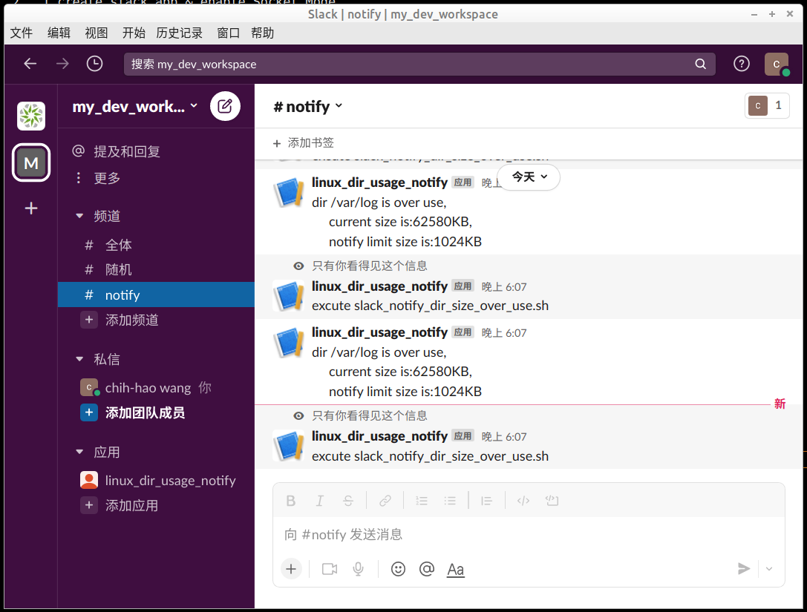

# slack app tutorials
https://api.slack.com/apps

## shell script: monitor folder usage with slack
1. create slack app & enable Socket Mode  
detial see  
"slack app tutorials"  
  
2. modify config  

shell_script/config.sh  
`MONITOR_DIR`             to be monitor dir  
`MONITOR_MAX_SIZE`    alter dir size  
`SLACK_TOKEN`             slack webhook token   


3. create crontab  

owan@deploy:~$ cat /etc/cron.d/slack_notify  
1 * * * * root /home/owan/first-bolt-app/shell_script/slack_notify_dir_size_over_use.sh >> /dev/null  

4. create .env file sotre slack token  

sample  
.env  
```
SLACK_BOT_TOKEN=<SLACK_BOT_TOKEN>
SLACK_APP_TOKEN=<SLACK_APP_TOKEN>
```

5. start app.py to recive command from slack  

`.venv/bin/python3 app.py `  

6. result  



### 發送訊息至 slack (webhook)
發送訊息的來源可以連線至 slack server 即可  
不須正式 certificat 及對外 ip  

建立 app 選擇 From scratch  


選擇 app 的 workgroup  


開啟 features - Incoming Webhooks  


add new webhook to workspace  


設定訊息目的地 channel 並允許
發布應用為 webhook 用


測試發送訊息  


檢查權限 OAuth & Permissions - Scopes  
自動產生 webhook 權限  


## backend app 
backend app 連接方式  
* Interactivity  -  需有正式 SSL 憑證及 public IP  
* Socket Mode  -  app server 連線至 slack server 維持 web socket , 不須 SSL 憑證及 public IP  

### bolt (SLACK SDK)
簡介
https://api.slack.com/tools/bolt

Bolt 提供三種語言 
* Bolt for JavaScript  
* Bolt for Python  
* Bolt for Java  

優點 -  Socket Mode  

安裝 sdk  
```powershell
python3 -m venv .venv
source .venv/bin/activate
pip install slack_bolt
```

api 範例
https://api.slack.com/messaging/retrieving

app 範例
https://github.com/slackapi/bolt-python/tree/main/examples

### api scope (premission)需求對應表
https://api.slack.com/legacy/oauth-scopes
token scope 增加時,不須 revoke token 重來
但移除 scope 須 revoke token 重來才有用

新增 scope 也要記的將 app 加入 channel 才能生效


確認目前擁有的 scope
```powershell
curl https://slack.com/api/files.list -H "Authorization: Bearer <bot token xoxb->" -I

```


### 使用 slash command 互動

slash command 
在 slack 中 輸入 /echo 或其他自訂指令可以與自己的 app 進行互動  

內建 command  
https://slack.com/help/articles/201259356-Slash-commands-in-Slack  

slash comman work flow  


